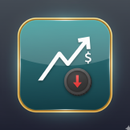

# Expensify

An Android app for tracking daily expenses, built with Jetpack Compose and Material 3.

<!-- ### Screenshots -->

## Features

- **Manage Expenses**: Add, edit, and delete expenses with a title, amount, category, and date.
- **Dashboard**: The home screen shows your total expenses, a pie chart of spending by category, and
  your most recent transactions.
- **Custom Categories**: Organize your spending with default categories or create your own.
- **Expense History**: See a full list of your transactions and filter them by today, this week, or
  this month.
- **Customizable Theme**:
  - Switch between light and dark modes.
  - Use the AMOLED-friendly black theme.
  - Pick a custom color to change the app's look and feel.

## Tech Stack

- **UI**: Jetpack Compose, Material 3
- **Architecture**: MVVM
- **Database**: Room
- **Async**: Kotlin Coroutines & Flow
- **Theming**: [Material Kolor](https://github.com/material-kolor/material-kolor)
- **Charts**: [Compose Charts](https://github.com/ehsannarmani/compose-charts)

## 🤝 Contributing

Contributions are welcome! If you have ideas for new features or find a bug, please feel free to
open an issue or submit a pull request.

## 📄 License

This project is licensed under the MIT License. See the [LICENSE](LICENSE) file for details.
