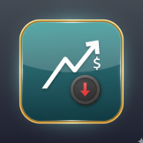
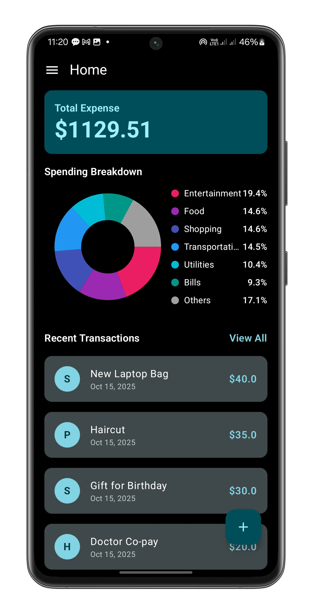
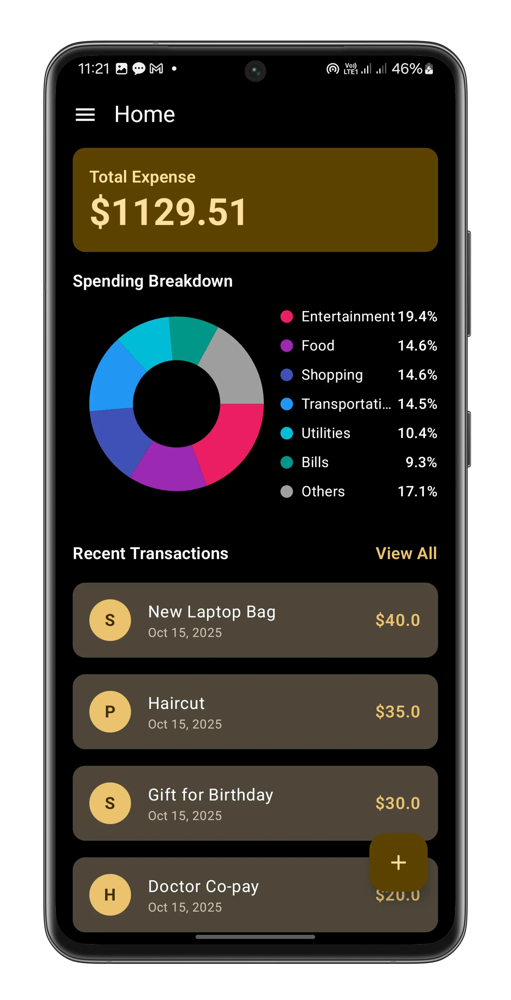
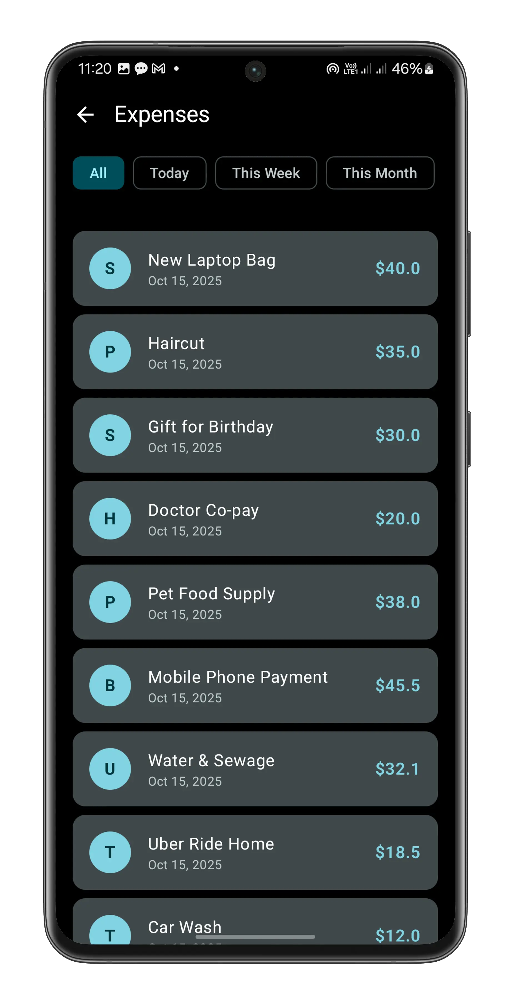

# Expensify

A modern Android app for tracking and managing daily expenses and budgets, built with Jetpack
Compose and
Material 3.

### Screenshots

## Features

- **Comprehensive Dashboard**: Get a quick overview of your finances with a dashboard that
  summarizes your total expenses and budget for the current month.
- **Expense Management**: Easily add, edit, and delete expenses. View your transaction history and
  filter by day, week, or month.
- **Flexible Budgeting**:
  - Create budgets with specific amounts or leave them open-ended.
  - Set budgets to be one-time or recurring (daily, weekly, monthly).
  - Track your spending against each budget with a detailed progress view.
- **Custom Categories**: Use default expense categories or create your own for personalized
  tracking.
- **Personalized Theming**:
  - Choose between light, dark, or AMOLED-friendly black themes.
  - Customize the app's color scheme to match your style.

## Tech Stack

- **UI**: Jetpack Compose, Material 3
- **Architecture**: MVVM
- **Database**: Room
- **Theming**: [Material Kolor](https://github.com/material-kolor/material-kolor)
- **Charts**: [Compose Charts](https://github.com/ehsannarmani/compose-charts)

## 🤝 Contributing

Contributions are welcome!  
If you have ideas for new features, improvements, or bug fixes, feel free to open an issue or submit
a pull request.

## 📄 License

This project is licensed under the MIT License. See the [LICENSE](LICENSE) file for details.
